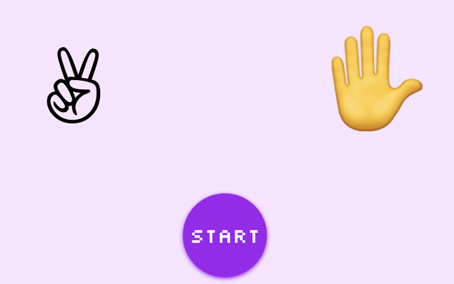

# Rock Paper Scissors Web App

This is a simple Rock Paper Scissors web app where the computer plays against itself. The app is built using HTML, CSS, and JavaScript.

## Features

- Displays a randomly generated Rock, Paper, or Scissors symbol for both the left and right sides.
- Highlights the winner in green and draws in yellow.
- Repeats the game every 100ms for 4 seconds and then shows the final result.

## How to use

1. Clone this repository or download the files.
2. Open the `index.html` file in your browser.
3. Click the "Start" button to start the game.
4. The game will play itself and show the result after 4 seconds.

## Files

- `index.html`: Contains the structure of the web app.
- `style.css`: Contains the styling for the web app.
- `script.js`: Contains the JavaScript code that handles the game logic and UI updates.
